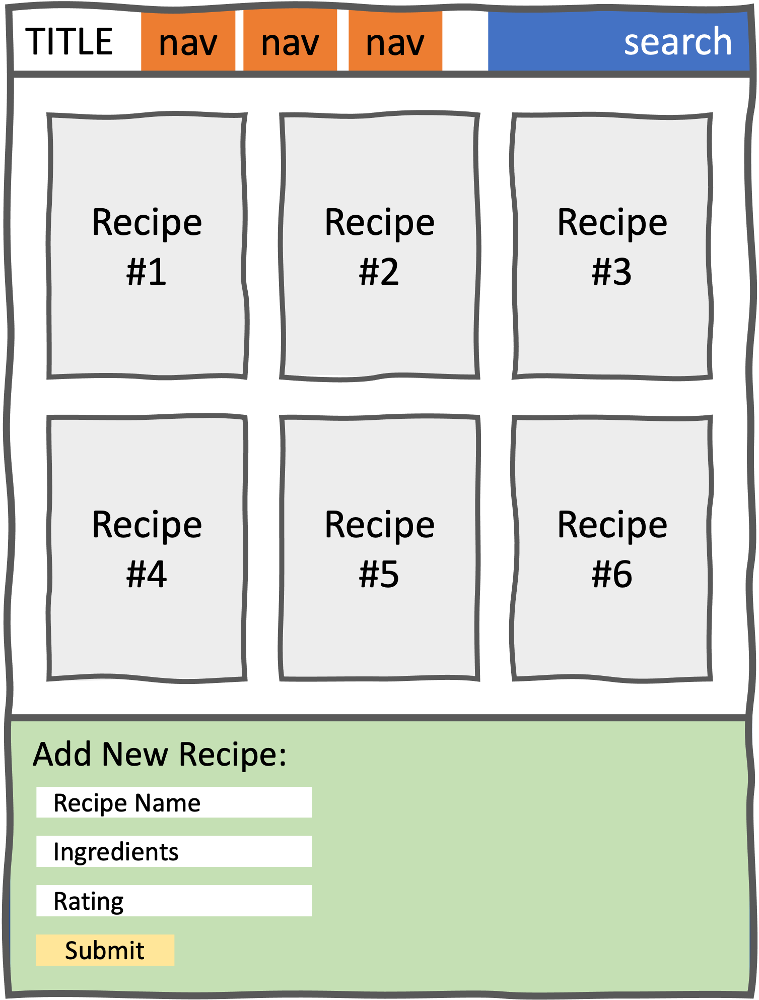

# React Forms Lab (Bakery cont'd)

## Aims

- To provide practice of building a **FORM** in React
- To provide more practice with passing **PROPS** in React
- To provide more practice with using the **USESTATE** HOOK
- To provide practice of **MAPPING** content (the provided list & json) to JSX components

## Intro
This lab references your previous Bakery lab, where you were able to set up a handful of components, including a form, and render them to the page. Your task today is to introduce a data set (an array of cake objects, provided below) and ensure that your form is fully functional, so that a new cake recipe can be added and viewed in the list of recipes. You will need to work with `state`, `props` and `controlled components`.

You should use the start code provided with this lab, which picks up where your previous lab left off.

## MVP

We would like you to create a React app that (a) renders a list of cake recipes and (b) allows a user to add a new cake to the list via a form.

- You may wish to start with a diagram to make it clear what the data flow in your app should be
- Introduce the data set (list of cakes) as `state` to your React app. It is no longer suitable for your `RecipeList` component to store your data, not least as you will shortly be implementing a functioning form.
- Allow your app to render your list of cakes - you will need to pass data as props to the relevent component(s)
- Once you have ascertained that you can render a list of cakes from a data set, set to work making your `CakeForm` fully functional. Remember a form in React is usually a controlled component and should have its own state. On submission of your form, your application should re-render your list of cakes to include the new addition.

## Extensions

- Write the necessary code to make your `Search` component fully functional (hint: remeber, it's just another form!)
- Add basic styling to your entire page using CSS


## Wireframe Design

Below is a simple wireframe design that you can optionally use. Please note that this exercise is focussed primarily on the building of a functioning form and the mapping of content, not CSS.




## Data Set

Below is the initial data state for this exercise. Start by saving this data set as a separate constant before you place it into state using `useState`.

```
[
    {
        cakeName: "Lemon Drizzle",
        ingredients: ["eggs", "butter", "lemon  zest", "sugar", "self-raising flour"],
        rating: 5
    },
    {
        cakeName: "Tea Loaf",
        ingredients: ["eggs", "oil", "dried fruit", "sugar", "self-raising flour", "strong tea"],
        rating: 3
    },
    {
        cakeName: "Brownie",
        ingredients: ["chocolate", "eggs", "flour", "butter", "walnuts"],
        rating: 4
    },
    {
        cakeName: "Carrot Cake",
        ingredients: ["carrots", "walnuts", "oil", "cream cheese", "flour", "sugar"],
        rating: 5
    }
  ]
```
